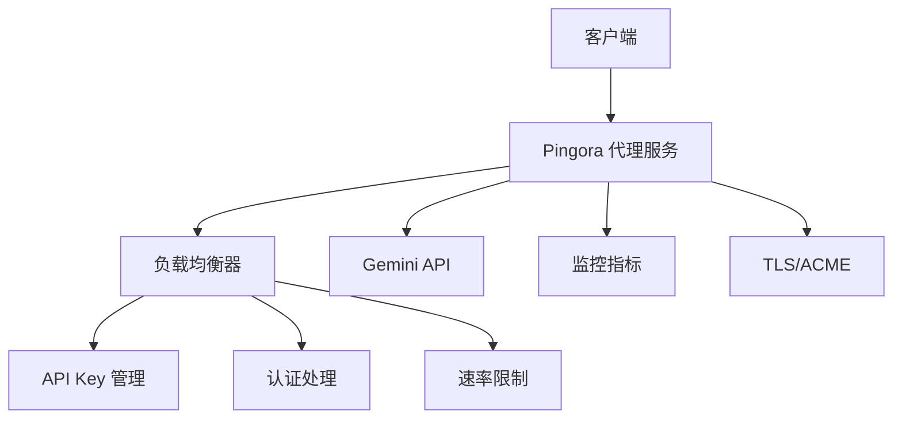

# CLAUDE.md

这个文件为 Claude Code (claude.ai/code) 在此代码库中工作提供指导。

## 项目概述

这是一个基于 Pingora 框架构建的 Rust Gemini API 代理服务，提供负载均衡、认证、速率限制以及 TLS/ACME 支持，用于代理到 Google Gemini API 的请求。



## 开发命令

### 构建和运行
```bash
# 构建项目
cargo build

# 发布版本构建
cargo build --release

# 运行代理服务器
cargo run

# 使用特定配置运行
RUST_LOG=info cargo run
```

### 开发工具
```bash
# 检查代码格式
cargo fmt --check

# 格式化代码
cargo fmt

# 运行 clippy 代码检查
cargo clippy

# 运行 clippy 检查所有特性
cargo clippy --all-features
```

### 测试
```bash
# 运行单元测试
cargo test

# 运行测试并输出详细信息
cargo test -- --nocapture

# 运行特定测试
cargo test test_name
```

## 架构设计

### 核心组件

1. **代理服务** (`src/proxy/`): 基于 Pingora 的主要 HTTP 代理逻辑
   - `service.rs`: 核心代理服务实现
   - `middleware.rs`: 请求/响应中间件
   - `acme_service.rs`: Let's Encrypt 的 ACME 挑战处理

2. **负载均衡器** (`src/load_balancer/`): API 密钥管理和轮换
   - `key_manager.rs`: 管理多个 Gemini API 密钥的轮询调度
   - `scheduler.rs`: 请求调度逻辑

3. **认证系统** (`src/auth/`): 基于 JWT 的认证和速率限制
   - `handler.rs`: JWT 验证和客户端速率限制

4. **配置管理** (`src/config/`): 基于 YAML 的配置管理
   - `settings.rs`: 服务器、TLS、认证、监控指标的配置结构

5. **监控指标** (`src/metrics/`): Prometheus 指标收集
   - `collector.rs`: 请求/响应指标和 API 密钥使用情况跟踪

6. **工具模块** (`src/utils/`): 辅助模块
   - `tls.rs`: TLS 证书管理和 ACME 集成
   - `health_check.rs`: 健康监控工具


### 核心特性

- **多密钥负载均衡**: 在多个 Gemini API 密钥之间轮换
- **TLS/ACME 支持**: 自动 Let's Encrypt 证书管理
- **JWT 认证**: Bearer 令牌验证
- **速率限制**: 客户端请求速率限制
- **Prometheus 监控**: 请求指标和 API 密钥使用情况跟踪
- **健康检查**: API 密钥故障检测和恢复

## 配置管理

代理通过 `config/proxy.yaml` 进行配置，包含以下部分：
- 服务器设置（主机、端口、TLS 配置）
- Gemini API 密钥和端点
- 认证设置（JWT 密钥、速率限制）
- 监控指标（Prometheus 端点）
- ACME 自动证书管理设置

## 关键依赖

- `pingora`: 核心代理框架
- `tokio`: 异步运行时
- `serde_yaml`: 配置解析
- `jsonwebtoken`: JWT 认证
- `prometheus`: 指标收集
- `acme-lib`: Let's Encrypt 集成
- `openssl`: TLS 支持

## 开发注意事项

- 主入口点是 `src/main.rs`，负责编排所有服务
- 代理实现了 Pingora 的 `ProxyHttp` trait 来处理请求/响应
- API 密钥具有自动故障检测和轮询轮换管理
- TLS 证书可以自动生成（自签名）或通过 ACME 管理
- 监控指标在单独的 HTTP 端点上暴露供 Prometheus 抓取

### 配置设置

运行代理前，确保你有：
1. 在 `config/proxy.yaml` 中配置有效的 Gemini API 密钥
2. 正确的 TLS 配置（开发时设置 `server.tls.enabled: false`）
3. 为认证配置 JWT 密钥

### 环境变量

- `RUST_LOG`: 控制日志级别（info, debug, warn, error）
- `CONFIG_PATH`: 覆盖默认配置文件路径（默认: `config/proxy.yaml`）

### 开发工作流程

1. 在 `config/proxy.yaml` 中更新 API 密钥
2. 使用 `RUST_LOG=debug cargo run` 运行以获得详细日志
3. 提交更改前使用 `cargo clippy` 检查代码
4. 启用时监控指标可在 `http://localhost:9090/metrics` 访问

### 重要实现细节

- **错误处理**: 在 `src/proxy/service.rs:240-255` 中实现响应过滤和 API 密钥成功/失败标记
- **密钥轮换**: 在 `src/load_balancer/key_manager.rs` 中实现轮询调度和健康检查
- **监控集成**: 在 `src/metrics/collector.rs` 中暴露 Prometheus 指标
- **TLS 管理**: 在 `src/utils/tls.rs` 中处理证书生成和 ACME 集成
- **配置热重载**: 支持通过信号重新加载配置而无需重启服务