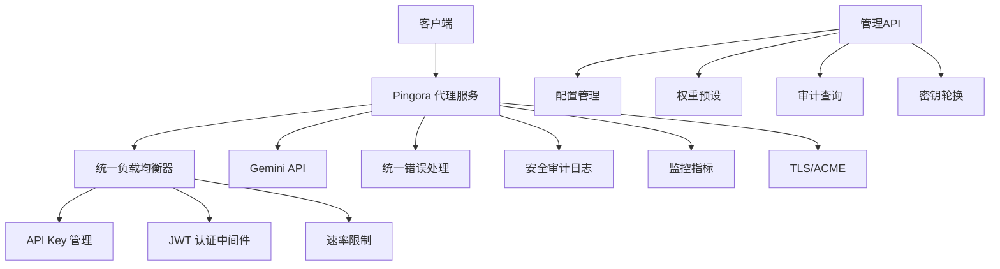

# CLAUDE.md

这个文件为 Claude Code (claude.ai/code) 在此代码库中工作提供指导。

## 项目概述

这是一个基于 Pingora 框架构建的企业级 Rust Gemini API 代理服务，提供负载均衡、认证、速率限制、安全审计以及 TLS/ACME 支持。经过深度架构优化，具备生产环境所需的安全性、可靠性和可维护性。



## 开发命令

### 构建和运行
```bash
# 构建项目
cargo build

# 发布版本构建
cargo build --release

# 运行代理服务器（包含安全验证）
cargo run

# 使用特定配置运行
RUST_LOG=info cargo run

# 检查配置安全性
cargo run -- --check-config
```

### 开发工具
```bash
# 检查代码格式
cargo fmt --check

# 格式化代码
cargo fmt

# 运行 clippy 代码检查
cargo clippy

# 运行 clippy 检查所有特性
cargo clippy --all-features
```

### 测试
```bash
# 运行单元测试
cargo test

# 运行测试并输出详细信息
cargo test -- --nocapture

# 运行特定测试
cargo test test_name

# 运行安全测试
cargo test security
```

## 架构设计

### 核心组件

1. **代理服务** (`src/proxy/`): 基于 Pingora 的主要 HTTP 代理逻辑
   - `service.rs`: 核心代理服务实现
   - `middleware.rs`: 请求/响应中间件
   - `acme_service.rs`: Let's Encrypt 的 ACME 挑战处理

2. **统一负载均衡器** (`src/load_balancer/`): 优化的 API 密钥管理和调度
   - `unified_manager.rs`: 统一密钥管理器，消除状态重复
   - `weighted_round_robin.rs`: 加权轮询调度算法
   - `optimizer.rs`: 智能权重优化和性能分析
   - `audit.rs`: 权重变更审计和快照管理

3. **认证系统** (`src/auth/`): 基于 JWT 的认证和权限管理
   - `handler.rs`: JWT 验证和客户端速率限制
   - API 路由自动 JWT 保护中间件

4. **配置管理** (`src/config/`): 增强的配置管理和验证
   - `settings.rs`: 服务器、TLS、认证、监控指标的配置结构
   - `validation.rs`: 配置语法和逻辑验证
   - 支持配置热重载和变更历史

5. **统一错误处理** (`src/error/`): 企业级错误管理系统
   - `mod.rs`: 统一错误类型 `GeminiProxyError`
   - `logging.rs`: 结构化错误日志和聚合
   - `recovery.rs`: 错误恢复机制（重试、熔断器、自愈）
   - `migration.rs`: 新旧错误系统兼容迁移

6. **安全模块** (`src/security/`): 全面的安全功能
   - `config_security.rs`: 配置安全验证和 CWE 分类
   - `key_management.rs`: 密钥生成、轮换和强度分析
   - `audit_logging.rs`: 安全审计日志和事件监控

7. **数据持久化** (`src/persistence/`): 状态和配置持久化
   - `config_history.rs`: 配置变更历史和回滚
   - `weight_presets.rs`: 权重预设管理
   - `session_state.rs`: 会话状态持久化

8. **监控指标** (`src/metrics/`): Prometheus 指标收集
   - `collector.rs`: 请求/响应指标和 API 密钥使用情况跟踪

9. **管理 API** (`src/api/`): 统一的管理接口
   - `config.rs`: 配置管理 API
   - `auth.rs`: JWT 认证 API
   - `weight_management.rs`: 权重管理 API
   - `load_balancing_stats.rs`: 负载均衡统计 API


### 核心特性

#### 基础功能
- **多密钥负载均衡**: 智能加权轮询和性能优化
- **TLS/ACME 支持**: 自动 Let's Encrypt 证书管理
- **JWT 认证**: Bearer 令牌验证和权限控制
- **速率限制**: 客户端请求速率限制

#### 企业级特性
- **统一错误处理**: 结构化错误日志、自动恢复、兼容迁移
- **安全配置验证**: 启动时安全检查、CWE 威胁分析、评分系统
- **审计合规**: 完整的 API 调用、配置变更、安全事件追踪
- **数据持久化**: 配置历史、权重预设、会话状态管理
- **性能监控**: Prometheus 指标、性能分析、异常检测

#### 管理功能
- **配置热重载**: 动态配置更新，无需重启服务
- **权重预设**: 预定义权重配置的快速切换
- **密钥轮换**: 自动密钥轮换和强度检查
- **故障恢复**: 熔断器、重试策略、自愈机制

## 配置管理

### 配置文件结构

代理通过 `config/proxy.yaml` 进行配置，支持以下配置段：

```yaml
server:
  host: "127.0.0.1"
  port: 8080
  tls:
    enabled: true
    cert_path: "certs/server.crt"
    key_path: "certs/server.key"

gemini:
  api_keys:
    - id: "primary"
      key: "your-secure-api-key"
      weight: 100
      max_requests_per_minute: 60

auth:
  enabled: true
  jwt_secret: "your-secure-jwt-secret"  # 至少32字符
  admin_password: "secure-admin-password"  # 至少12字符
  token_expiry_hours: 24
  session_timeout_minutes: 60

metrics:
  enabled: true
  prometheus_port: 9090
```

### 安全配置要求

启动时会进行全面的安全配置检查：

- **JWT 密钥**: 最少32字符，包含大小写字母、数字、特殊字符
- **管理员密码**: 最少12字符，避免常见弱密码
- **API 密钥**: 避免示例密钥，确保有效性
- **TLS 配置**: 生产环境必须启用 TLS
- **网络安全**: 检查绑定地址和端口配置

## 关键依赖

### 核心依赖
- `pingora`: 高性能代理框架
- `tokio`: 异步运行时
- `serde_yaml`: 配置解析
- `jsonwebtoken`: JWT 认证
- `prometheus`: 指标收集
- `warp`: 管理 API 服务器

### 安全依赖
- `acme-lib`: Let's Encrypt 集成
- `openssl`: TLS 支持
- `argon2`: 密码哈希
- `rand`: 安全随机数生成
- `base64`: 编码支持

## API 端点

### 监控端点（无需认证）
- `GET /metrics` - Prometheus 指标
- `GET /health` - 健康检查
- `GET /performance` - 性能统计
- `GET /errors` - 错误统计

### 认证端点
- `POST /auth/login` - 管理员登录
- `POST /auth/refresh` - 刷新令牌
- `POST /auth/logout` - 登出

### 管理端点（需要 JWT 认证）
- `GET /api/config` - 获取配置
- `PUT /api/config` - 更新配置
- `GET /api/config/history` - 配置历史
- `GET /api/weights/presets` - 权重预设
- `POST /api/weights/apply` - 应用权重预设
- `GET /api/stats/load-balancing` - 负载均衡统计

## 开发注意事项

### 启动流程

1. **配置验证**: 语法检查、逻辑验证、安全评估
2. **安全检查**: 密钥强度、威胁分析、CWE 分类
3. **服务初始化**: 代理服务、管理 API、监控指标
4. **审计记录**: 启动事件记录到审计日志

### 错误处理模式

使用统一的 `GeminiProxyError` 类型：

```rust
// 创建错误
let error = GeminiProxyError::config_with_context(
    "配置验证失败",
    "config_loader", 
    "validate_config"
).with_severity(ErrorSeverity::Critical);

// 错误恢复
recovery_manager.attempt_recovery(&error, operation).await?;

// 错误日志
error_logger.log_error(&error).await?;
```

### 配置热重载

支持动态配置更新：

```bash
# 发送 SIGHUP 信号重载配置
kill -HUP <pid>

# 通过 API 更新配置
curl -X PUT /api/config -H "Authorization: Bearer <token>" -d @new_config.json
```

### 安全最佳实践

1. **密钥管理**: 使用强密钥，定期轮换
2. **TLS 配置**: 生产环境必须启用 HTTPS
3. **访问控制**: JWT 令牌保护管理 API
4. **审计日志**: 启用完整的操作审计
5. **监控告警**: 配置 Prometheus 告警规则

### 性能优化

- **统一状态管理**: 消除锁竞争，提高并发性能
- **智能负载均衡**: 基于性能指标的动态权重调整
- **连接池**: 复用 HTTP 连接，减少延迟
- **异步处理**: 全异步架构，支持高并发

### 故障处理

系统具备多层故障处理机制：

1. **熔断器**: 自动检测故障 API 密钥并暂时禁用
2. **重试策略**: 指数退避重试失败的请求
3. **降级机制**: 在部分服务不可用时继续提供基础功能
4. **自愈能力**: 定期检查故障组件并尝试恢复

### 重要实现细节

- **统一错误处理**: `src/error/mod.rs` - 企业级错误管理系统
- **负载均衡优化**: `src/load_balancer/unified_manager.rs` - 消除状态重复
- **安全配置验证**: `src/security/config_security.rs` - 启动时安全检查
- **审计日志**: `src/security/audit_logging.rs` - 完整操作追踪
- **配置管理**: `src/config/validation.rs` - 增强的配置验证
- **API 认证保护**: `src/api/auth.rs` - JWT 中间件自动保护

### 环境变量

- `RUST_LOG`: 控制日志级别（info, debug, warn, error）
- `CONFIG_PATH`: 覆盖默认配置文件路径（默认: `config/proxy.yaml`）
- `SECURITY_CHECK`: 设置为 `strict` 启用严格安全检查

### 部署建议

1. **安全配置**: 确保所有安全配置项都已正确设置
2. **TLS 证书**: 配置有效的 TLS 证书或启用 ACME
3. **监控接入**: 将 Prometheus 指标接入监控系统
4. **日志收集**: 配置日志收集系统读取审计日志
5. **备份策略**: 定期备份配置和权重预设数据