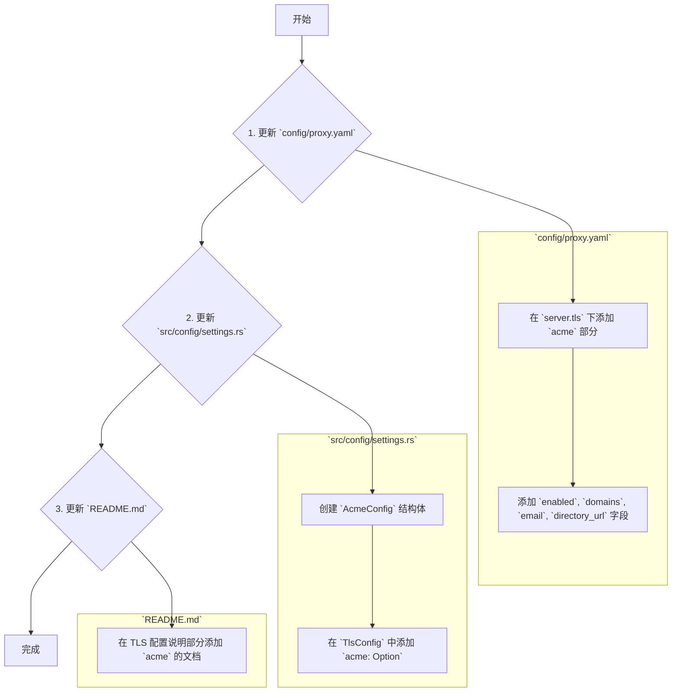

# ACME 证书自动续期功能设计方案

## 1. 计划概述

本计划旨在为项目添加 ACME (Automatic Certificate Management Environment) 证书自动续期功能。主要涉及更新配置文件、更新代码中的配置结构体以及更新项目文档。

计划分为三个主要步骤：

1.  **更新配置文件 (`config/proxy.yaml`)**: 在 `server.tls` 部分添加新的 `acme` 配置项。
2.  **更新配置结构体 (`src/config/settings.rs`)**: 创建一个新的 `AcmeConfig` 结构体，并将其嵌入到 `TlsConfig` 中，以在代码中反映配置的变化。
3.  **更新文档 (`README.md`)**: 在文档的 TLS 配置部分，添加关于如何配置和使用 ACME 功能的详细说明。

## 2. Mermaid 流程图

## 3. 具体实施步骤

1.  **修改 `config/proxy.yaml`**:
    *   在 `server.tls` 配置下，插入 `acme` 相关的配置。

2.  **修改 `src/config/settings.rs`**:
    *   定义一个新的 `pub struct AcmeConfig`，包含 `enabled`、`domains`、`email` 和 `directory_url` 字段。
    *   在 `TlsConfig` 结构体中添加一个新字段 `pub acme: Option<AcmeConfig>`。

3.  **修改 `README.md`**:
    *   在现有的“TLS 配置说明”部分下方，增加一个新的子章节，详细解释 `acme` 配置块中每个字段的含义和用法。