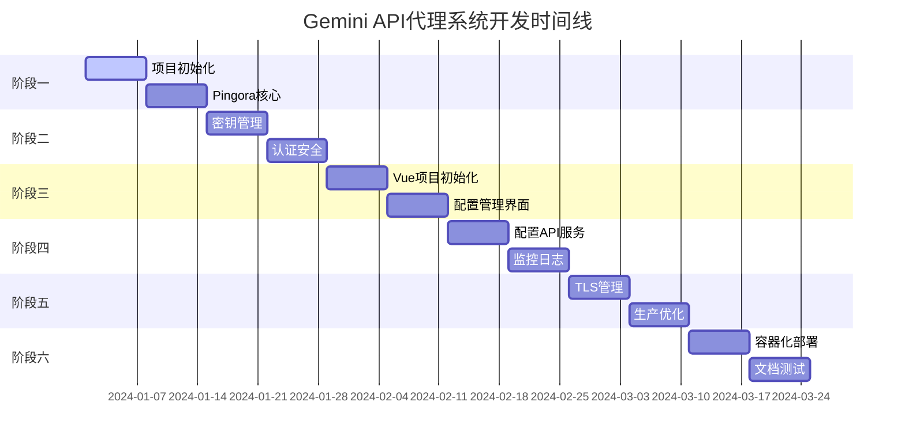

# Gemini API代理系统实施计划

## 📋 项目概述

本项目基于Pingora框架构建一个高性能的Gemini API代理系统，具备多密钥负载均衡、动态配置管理、自动TLS证书管理和Vue.js Web管理界面等特性。

## 🎯 总体目标

- 构建高性能、稳定可靠的Gemini API代理服务
- 实现多API密钥的智能负载均衡和故障转移
- 提供现代化的Web管理界面
- 支持自动TLS证书管理和热重载配置

## 📅 实施计划

### 阶段一：核心基础设施 (第1-2周)

#### 1.1 项目初始化和环境搭建
**目标**: 建立开发环境和项目基础结构

**任务列表**:
- [ ] 创建Rust项目结构
  - 初始化Cargo.toml配置
  - 设置项目目录结构
  - 配置开发依赖项
- [ ] 设置开发环境
  - 安装Rust工具链 (1.75+)
  - 配置IDE开发环境
  - 设置代码格式化和检查工具
- [ ] 创建基础配置系统
  - 实现YAML配置文件解析
  - 定义配置结构体
  - 添加配置验证逻辑

**交付物**:
- 完整的项目目录结构
- 基础的Cargo.toml配置
- 配置解析模块 (`src/config/`)

**验收标准**:
- 项目能够成功编译
- 配置文件能够正确解析
- 代码通过clippy检查

#### 1.2 Pingora代理核心实现
**目标**: 实现基础的HTTP代理功能

**任务列表**:
- [ ] 实现ProxyHttp trait
  - 创建基础代理服务结构
  - 实现请求/响应处理逻辑
  - 添加基础日志记录
- [ ] 实现上游连接管理
  - 创建HttpPeer连接
  - 实现连接池管理
  - 添加超时和重试机制
- [ ] 添加基础中间件
  - 请求头处理中间件
  - 响应头清理中间件
  - 访问日志中间件

**交付物**:
- 核心代理服务 (`src/proxy/service.rs`)
- 中间件系统 (`src/proxy/middleware.rs`)
- 基础测试用例

**验收标准**:
- 代理服务能够转发HTTP请求
- 日志记录功能正常
- 单元测试通过率 > 80%

### 阶段二：负载均衡和密钥管理 (第3-4周)

#### 2.1 API密钥管理系统
**目标**: 实现Gemini API多密钥管理

**任务列表**:
- [ ] 设计密钥管理架构
  - 定义ApiKey数据结构
  - 实现密钥状态管理
  - 添加密钥有效性检查
- [ ] 实现密钥轮询调度
  - 轮询算法实现
  - 加权轮询支持
  - 失败密钥自动切换
- [ ] 添加健康检查机制
  - 定期密钥可用性检查
  - 故障检测和恢复
  - 性能指标收集

**交付物**:
- 密钥管理器 (`src/load_balancer/key_manager.rs`)
- 调度器实现 (`src/load_balancer/scheduler.rs`)
- 健康检查工具 (`src/utils/health_check.rs`)

**验收标准**:
- 支持多密钥轮询切换
- 故障密钥能够自动隔离
- 健康检查功能正常运行

#### 2.2 认证和安全模块
**目标**: 实现JWT认证和基础安全功能

**任务列表**:
- [ ] 实现JWT认证
  - JWT token验证
  - Bearer token提取
  - 认证失败处理
- [ ] 添加速率限制
  - 基于IP的限流
  - 滑动窗口算法
  - 限流规则配置
- [ ] 实现访问控制
  - IP白名单/黑名单
  - 用户代理过滤
  - 请求头安全检查

**交付物**:
- 认证处理器 (`src/auth/handler.rs`)
- 安全中间件集成
- 安全配置示例

**验收标准**:
- JWT认证功能正常
- 速率限制有效工作
- 安全策略能够正确执行

### 阶段三：前端管理界面 (第5-6周)

#### 3.1 Vue.js项目初始化
**目标**: 建立现代化的前端开发环境

**任务列表**:
- [ ] 创建Vue.js项目
  - 使用Vite构建工具
  - 配置TypeScript支持
  - 集成Element Plus UI库
- [ ] 设置项目架构
  - 配置路由系统 (Vue Router)
  - 设置状态管理 (Pinia)
  - 创建API调用层
- [ ] 实现布局框架
  - 响应式布局设计
  - 导航栏组件
  - 侧边栏菜单

**交付物**:
- Vue.js项目结构 (`frontend/`)
- 基础UI组件库
- 项目构建配置

**验收标准**:
- 前端项目能够正常启动
- TypeScript类型检查通过
- 基础布局显示正常

#### 3.2 核心配置管理界面
**目标**: 实现配置管理的Web界面

**任务列表**:
- [ ] 设计配置管理页面
  - 标签页式配置界面
  - 实时配置验证
  - 配置预览功能
- [ ] 实现Gemini API密钥管理
  - 密钥列表展示
  - 密钥添加/编辑/删除
  - 密钥状态监控
- [ ] 添加TLS证书管理
  - ACME配置界面
  - 证书状态显示
  - 域名管理功能

**交付物**:
- 配置管理页面 (`frontend/src/views/ProxyConfig.vue`)
- Gemini配置组件 (`frontend/src/components/config/GeminiConfig.vue`)
- TLS配置组件

**验收标准**:
- 配置界面功能完整
- 表单验证工作正常
- 与后端API集成成功

### 阶段四：配置管理API服务 (第7-8周)

#### 4.1 RESTful API设计实现
**目标**: 为前端提供配置管理API

**任务列表**:
- [ ] 设计API接口规范
  - 定义RESTful API路由
  - 设计请求/响应格式
  - 添加API文档
- [ ] 实现配置CRUD操作
  - 获取当前配置
  - 更新配置信息
  - 配置验证和保存
- [ ] 集成热重载机制
  - 配置变更通知
  - 服务热重启触发
  - 回滚机制实现

**交付物**:
- 配置管理API服务
- API文档和测试
- 热重载实现

**验收标准**:
- API接口功能完整
- 配置热重载正常工作
- API文档清晰完整

#### 4.2 监控和日志系统
**目标**: 实现基础监控和日志功能

**任务列表**:
- [ ] 集成Prometheus监控
  - 定义核心指标
  - 实现指标收集器
  - 暴露metrics端点
- [ ] 实现结构化日志
  - JSON格式日志输出
  - 日志级别配置
  - 日志轮转设置
- [ ] 添加健康检查端点
  - 服务健康状态检查
  - 依赖服务状态检查
  - 监控指标暴露

**交付物**:
- 监控指标收集器 (`src/metrics/collector.rs`)
- 日志配置和工具
- 健康检查端点

**验收标准**:
- Prometheus指标正常暴露
- 日志格式规范化
- 健康检查功能正常

### 阶段五：TLS和ACME集成 (第9-10周)

#### 5.1 TLS证书管理
**目标**: 实现自动TLS证书管理

**任务列表**:
- [ ] 实现ACME客户端
  - Let's Encrypt集成
  - HTTP-01挑战支持
  - 证书自动申请
- [ ] 添加证书管理功能
  - 证书存储和加载
  - 证书续期检查
  - 多域名证书支持
- [ ] 实现证书热更新
  - 证书变更检测
  - 无缝证书切换
  - 证书状态监控

**交付物**:
- ACME服务实现 (`src/proxy/acme_service.rs`)
- TLS工具模块 (`src/utils/tls.rs`)
- 证书管理界面

**验收标准**:
- ACME证书申请成功
- 证书自动续期工作
- TLS服务正常运行

#### 5.2 生产环境优化
**目标**: 为生产部署做优化

**任务列表**:
- [ ] 性能优化
  - 连接池优化
  - 内存使用优化
  - 请求处理性能调优
- [ ] 错误处理完善
  - 全面的错误处理
  - 优雅的错误响应
  - 错误日志记录
- [ ] 配置验证加强
  - 配置格式验证
  - 依赖检查
  - 启动时配置检查

**交付物**:
- 性能优化版本
- 完善的错误处理
- 配置验证机制

**验收标准**:
- 性能指标达到设计要求
- 错误处理覆盖全面
- 配置验证严格有效

### 阶段六：部署和运维 (第11-12周)

#### 6.1 容器化和部署
**目标**: 实现Docker化部署

**任务列表**:
- [ ] 创建Docker镜像
  - 多阶段构建Dockerfile
  - 镜像大小优化
  - 安全配置优化
- [ ] 编写Docker Compose
  - 服务编排配置
  - 环境变量管理
  - 数据卷配置
- [ ] 部署脚本开发
  - 自动化部署脚本
  - 健康检查脚本
  - 备份和恢复脚本

**交付物**:
- Docker镜像和配置
- Docker Compose文件
- 部署和运维脚本

**验收标准**:
- Docker镜像构建成功
- 容器化部署正常运行
- 部署脚本功能完整

#### 6.2 文档和测试完善
**目标**: 完善项目文档和测试

**任务列表**:
- [ ] 编写使用文档
  - 安装部署指南
  - 配置说明文档
  - API使用文档
- [ ] 完善测试覆盖
  - 单元测试补充
  - 集成测试编写
  - 性能测试实施
- [ ] 生产部署验证
  - 生产环境部署测试
  - 性能基准测试
  - 安全扫描检查

**交付物**:
- 完整项目文档
- 测试套件
- 生产部署验证报告

**验收标准**:
- 文档清晰完整
- 测试覆盖率 > 80%
- 生产部署成功

## 📊 里程碑和时间线

## 🎯 关键成功指标 (KPI)

### 技术指标
- **性能**: QPS > 10,000, 延迟P99 < 50ms
- **可用性**: 服务可用率 > 99.9%
- **代码质量**: 测试覆盖率 > 80%, Clippy检查通过
- **安全性**: 所有API认证保护, TLS加密传输

### 功能指标
- **密钥管理**: 支持 > 10个API密钥, 自动故障转移
- **配置管理**: Web界面功能完整, 热重载 < 10s
- **证书管理**: ACME自动续期, 多域名支持
- **监控**: 核心指标暴露, 告警机制完善

## 🚧 风险识别和缓解

### 技术风险
1. **Pingora版本兼容性**
   - 风险: Pingora API变更导致兼容问题
   - 缓解: 锁定特定版本, 定期更新测试

2. **性能瓶颈**
   - 风险: 高并发下性能不达标
   - 缓解: 早期性能测试, 分阶段优化

3. **TLS证书申请失败**
   - 风险: Let's Encrypt限流或服务不可用
   - 缓解: 实现静态证书fallback, 多CA支持

### 项目风险
1. **开发时间延期**
   - 风险: 功能复杂度超出预期
   - 缓解: 分阶段交付, 核心功能优先

2. **资源不足**
   - 风险: 开发资源不够或技能不匹配
   - 缓解: 提前技能培训, 外部支持

## 📋 资源需求

### 开发资源
- **后端开发**: 1-2人, Rust经验
- **前端开发**: 1人, Vue.js经验  
- **DevOps**: 0.5人, Docker/K8s经验
- **测试**: 0.5人, 自动化测试经验

### 基础设施
- **开发环境**: 4核8G开发机 × 2台
- **测试环境**: 2核4G测试服务器 × 1台
- **生产环境**: 4核8G生产服务器 × 2台 (主备)

### 外部依赖
- **域名**: 用于TLS证书申请和测试
- **云服务**: Docker镜像仓库, DNS服务
- **监控**: Prometheus/Grafana服务 (可选)

## 🎉 项目交付

### 最终交付物
1. **核心代理服务**: 完整的Rust代理应用
2. **Web管理界面**: Vue.js配置管理界面
3. **部署包**: Docker镜像和部署脚本
4. **文档集**: 安装、配置、API文档
5. **测试套件**: 单元测试和集成测试

### 验收标准
- 所有功能模块正常运行
- 性能指标达到设计要求
- 安全检查全部通过
- 文档完整清晰
- 生产环境部署成功

---

**项目负责人**: 开发团队
**创建时间**: 2024年1月
**版本**: v1.0
**状态**: 计划阶段

> 此计划将根据实际开发进度和需求变更进行调整更新