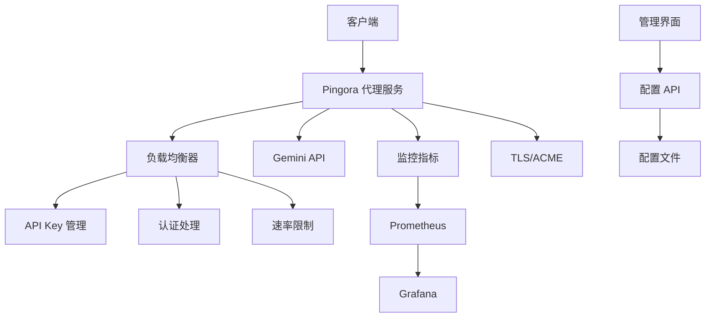

# Gemini API 代理服务

一个基于 Rust 和 Pingora 框架构建的高性能 Gemini API 代理服务，提供负载均衡、认证、速率限制、TLS/ACME 支持以及全面的监控功能。

## ✨ 主要特性

- 🚀 **高性能代理**: 基于 Pingora 框架，支持高并发请求处理
- ⚖️ **智能负载均衡**: 多 API 密钥轮换和故障转移
- 🔐 **安全认证**: JWT 令牌验证和速率限制
- 🔒 **TLS/ACME 支持**: 自动 Let's Encrypt 证书管理
- 📊 **实时监控**: Prometheus 指标和 Grafana 仪表板
- 🌐 **管理界面**: Vue.js 构建的现代化 Web 管理界面
- 🐳 **容器化部署**: 完整的 Docker 和 Docker Compose 支持
- 🛠️ **运维工具**: 自动化部署、备份和监控脚本

## 🏗️ 架构设计



## 🚀 快速开始

### 先决条件

- Rust 1.75+
- Docker 和 Docker Compose
- Node.js 18+ (仅用于前端开发)

### 1. 克隆项目

```bash
git clone https://github.com/your-org/gem-proxy.git
cd gem-proxy
```

### 2. 配置服务

复制示例配置文件并修改：

```bash
cp config/proxy.yaml.example config/proxy.yaml
```

编辑 `config/proxy.yaml`，配置您的 Gemini API 密钥：

```yaml
server:
  host: \"0.0.0.0\"
  port: 8443
  workers: 4
  max_connections: 1000
  tls:
    enabled: true
    cert_path: \"certs/cert.pem\"
    key_path: \"certs/key.pem\"

gemini:
  api_keys:
    - id: \"key1\"
      key: \"your-gemini-api-key\"
      weight: 1
      max_requests_per_minute: 100
  base_url: \"https://generativelanguage.googleapis.com\"
  timeout_seconds: 30

auth:
  enabled: true
  jwt_secret: \"your-jwt-secret-here\"
  rate_limit_per_minute: 60

metrics:
  enabled: true
  prometheus_port: 9090
```

### 3. 使用 Docker 部署

#### 快速启动（推荐）

```bash
# 一键启动，自动生成自签证书
./scripts/quickstart.sh
```

#### 手动部署

```bash
# 传统部署方式
./scripts/deploy.sh

# 或者手动构建和启动
docker-compose up -d
```

### 4. 访问服务

- **代理服务**: https://localhost:8443 (HTTPS，自签证书)
- **管理界面**: http://localhost:9090
- **Prometheus**: http://localhost:9091
- **Grafana**: http://localhost:3000 (admin/admin)

> **注意**: 默认使用自签证书，浏览器可能会显示安全警告。生产环境建议配置有效的 SSL 证书。

## 📚 详细文档

### 配置说明

#### 服务器配置

```yaml
server:
  host: \"0.0.0.0\"        # 监听地址
  port: 8080              # 监听端口
  workers: 4              # 工作进程数
  max_connections: 1000   # 最大连接数
  tls:
    enabled: true         # 启用 TLS
    cert_path: \"certs/cert.pem\"
    key_path: \"certs/key.pem\"
    acme:                 # ACME 自动证书
      enabled: true
      domains: [\"api.example.com\"]
      email: \"admin@example.com\"
      directory_url: \"https://acme-v02.api.letsencrypt.org/directory\"
```

#### API 密钥配置

```yaml
gemini:
  api_keys:
    - id: \"primary\"
      key: \"your-api-key\"
      weight: 2           # 权重，影响负载分配
      max_requests_per_minute: 100
    - id: \"backup\"
      key: \"backup-api-key\"
      weight: 1
      max_requests_per_minute: 50
```

#### 认证配置

```yaml
auth:
  enabled: true
  jwt_secret: \"your-secret\"  # 至少32字符
  rate_limit_per_minute: 60    # 每分钟请求限制
```

### API 使用

#### 认证

所有请求需要在 Header 中携带 JWT 令牌：

```bash
curl -k -H \"Authorization: Bearer your-jwt-token\" \\
     -H \"Content-Type: application/json\" \\
     -d '{\"contents\":[{\"parts\":[{\"text\":\"Hello\"}]}]}' \\
     https://localhost:8443/v1/models/gemini-pro:generateContent
```

> **注意**: 使用 `-k` 参数跳过自签证书验证

#### 管理 API

```bash
# 获取配置
curl http://localhost:9090/api/config

# 更新配置
curl -X PUT http://localhost:9090/api/config \\
     -H \"Content-Type: application/json\" \\
     -d @new-config.json

# 健康检查
curl http://localhost:9090/health

# 性能指标
curl http://localhost:9090/performance

# 错误统计
curl http://localhost:9090/errors
```

## 🔧 开发指南

### 本地开发

```bash
# 安装依赖
cargo build

# 运行测试
cargo test

# 启动开发服务器
RUST_LOG=debug cargo run

# 代码格式化
cargo fmt

# 代码检查
cargo clippy
```

### 前端开发

```bash
cd frontend

# 安装依赖
npm install

# 启动开发服务器
npm run dev

# 构建生产版本
npm run build
```

### 项目结构

```
gem-proxy/
├── src/
│   ├── main.rs              # 主入口
│   ├── config/              # 配置管理
│   ├── proxy/               # 代理服务
│   ├── load_balancer/       # 负载均衡
│   ├── auth/                # 认证模块
│   ├── metrics/             # 监控指标
│   ├── api/                 # 管理 API
│   └── utils/               # 工具模块
├── frontend/                # Web 管理界面
├── config/                  # 配置文件
├── scripts/                 # 运维脚本
├── monitoring/              # 监控配置
└── docs/                    # 文档
```

## 📊 监控和运维

### 监控指标

- **QPS**: 每秒请求数
- **成功率**: 请求成功百分比
- **响应时间**: P50, P95, P99 响应时间
- **API 密钥状态**: 各密钥健康状况
- **资源使用**: CPU、内存、连接数

### 运维脚本

```bash
# 部署服务
./scripts/deploy.sh

# 监控服务
./scripts/monitor.sh status     # 检查状态
./scripts/monitor.sh watch      # 实时监控
./scripts/monitor.sh report     # 生成报告

# 备份数据
./scripts/backup.sh

# 恢复备份
./scripts/backup.sh --restore backup-file.tar.gz
```

### 告警配置

Prometheus 告警规则位于 `monitoring/alert_rules.yml`：

- 服务下线告警
- 高错误率告警
- 响应时间过长告警
- API 密钥故障告警
- 资源使用过高告警

## 🐳 Docker 部署

### 生产环境部署

```bash
# 克隆项目
git clone https://github.com/your-org/gem-proxy.git
cd gem-proxy

# 配置环境
cp config/proxy.yaml.example config/proxy.yaml
# 编辑配置文件...

# 部署服务
./scripts/deploy.sh

# 检查状态
docker-compose ps
./scripts/monitor.sh status
```

### 扩展部署

```yaml
# docker-compose.override.yml
version: '3.8'
services:
  gemini-proxy:
    deploy:
      replicas: 3
    ports:
      - \"8443-8445:8443\"
```

## 🔒 HTTPS 和证书配置

### 自签证书（默认）

系统默认启用 HTTPS 并自动生成自签证书：

```bash
# 自动生成证书（在快速启动时执行）
./scripts/quickstart.sh

# 手动生成自签证书
openssl genrsa -out certs/key.pem 2048
openssl req -new -x509 -key certs/key.pem -out certs/cert.pem -days 365 \
  -subj "/C=CN/ST=Beijing/L=Beijing/O=Gemini Proxy/CN=localhost" \
  -addext "subjectAltName=DNS:localhost,DNS:gemini-proxy,IP:127.0.0.1"
```

### 生产环境证书

#### 1. Let's Encrypt (ACME)

```yaml
# config/proxy.yaml
server:
  tls:
    enabled: true
    acme:
      enabled: true
      domains:
        - "api.yourcompany.com"
      email: "admin@yourcompany.com"
      directory_url: "https://acme-v02.api.letsencrypt.org/directory"
```

#### 2. 自有证书

```yaml
# config/proxy.yaml
server:
  tls:
    enabled: true
    cert_path: "/path/to/your/cert.pem"
    key_path: "/path/to/your/key.pem"
    acme:
      enabled: false
```

### 证书信任

#### 开发环境

```bash
# macOS - 信任自签证书
sudo security add-trusted-cert -d -r trustRoot -k /Library/Keychains/System.keychain certs/cert.pem

# Linux - 添加到信任列表
sudo cp certs/cert.pem /usr/local/share/ca-certificates/gemini-proxy.crt
sudo update-ca-certificates

# Windows - 导入到受信任的根证书
certlm.msc # 手动导入证书
```

#### 客户端忽略证书验证

```bash
# curl 跳过证书验证
curl -k https://localhost:8443/health

# wget 跳过证书验证  
wget --no-check-certificate https://localhost:8443/health

# Node.js 环境变量
export NODE_TLS_REJECT_UNAUTHORIZED=0
```

## 🔒 安全最佳实践

1. **API 密钥安全**
   - 定期轮换 API 密钥
   - 使用环境变量存储敏感信息
   - 限制密钥权限

2. **网络安全**
   - 启用 TLS/HTTPS
   - 使用防火墙限制访问
   - 定期更新证书

3. **认证安全**
   - 使用强 JWT 密钥
   - 实施速率限制
   - 监控异常访问

## 🚨 故障排除

### 常见问题

1. **服务启动失败**
   ```bash
   # 检查配置文件
   ./scripts/monitor.sh status
   
   # 查看日志
   docker-compose logs gemini-proxy
   ```

2. **API 密钥错误**
   ```bash
   # 检查密钥状态
   curl http://localhost:9090/health
   ```

3. **性能问题**
   ```bash
   # 查看性能指标
   ./scripts/monitor.sh metrics
   
   # 生成性能报告
   ./scripts/monitor.sh report
   ```

### 日志分析

```bash
# 查看实时日志
docker-compose logs -f gemini-proxy

# 搜索错误日志
docker-compose logs gemini-proxy | grep ERROR

# 分析访问模式
docker-compose logs gemini-proxy | grep \"API request\"
```

## 📈 性能优化

### 调优建议

1. **并发设置**
   - 根据 CPU 核心数调整 `workers`
   - 适当设置 `max_connections`

2. **缓存优化**
   - 启用 Redis 缓存
   - 配置适当的缓存策略

3. **监控优化**
   - 调整监控采集频率
   - 优化告警阈值

## 🤝 贡献指南

1. Fork 项目
2. 创建特性分支
3. 提交更改
4. 推送到分支
5. 创建 Pull Request

### 开发规范

- 遵循 Rust 编码规范
- 编写单元测试
- 更新相关文档
- 通过 CI/CD 检查

## 📄 许可证

本项目采用 MIT 许可证 - 详见 [LICENSE](LICENSE) 文件。

## 🔗 相关链接

- [Pingora 框架](https://github.com/cloudflare/pingora)
- [Gemini API 文档](https://ai.google.dev/docs)
- [Prometheus 监控](https://prometheus.io/)
- [Grafana 可视化](https://grafana.com/)

## 📞 支持

如有问题或建议，请：

1. 查看 [文档](docs/)
2. 搜索 [Issues](https://github.com/your-org/gem-proxy/issues)
3. 创建新的 Issue
4. 联系维护团队

---

⭐ 如果这个项目对您有帮助，请给我们一个 Star！