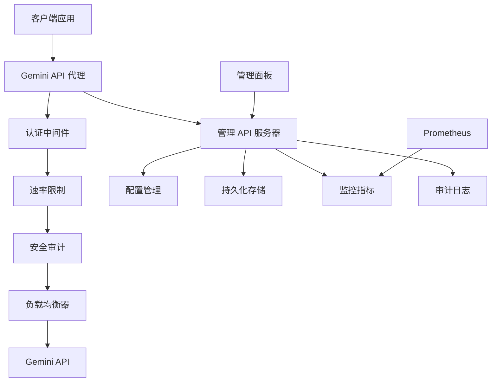

# Gemini API 代理 - 完整 API 参考文档

本文档描述了企业级 Gemini API 代理服务的完整接口，包括代理功能、管理API、安全审计、持久化功能和监控系统。

## 📋 目录

- [服务架构概览](#服务架构概览)
- [代理 API](#代理-api)
- [管理 API](#管理-api)
- [安全审计 API](#安全审计-api)
- [持久化 API](#持久化-api)
- [监控与指标 API](#监控与指标-api)
- [认证与授权](#认证与授权)
- [错误处理](#错误处理)
- [客户端集成](#客户端集成)

## 🏗️ 服务架构概览



### 核心端点

| 服务 | 端口 | 用途 | TLS |
|------|------|------|-----|
| 代理服务 | 8080/443 | Gemini API 请求转发 | 可选/推荐 |
| 管理 API | 9090 | 配置、监控、审计 | 可选 |
| 健康检查 | 9090 | 服务健康状态 | 同上 |
| Prometheus | 9090 | 指标暴露 | 同上 |

## 🔄 代理 API

### 基础请求格式

代理服务透明转发所有 Gemini API 请求，支持完整的 API 兼容性。

#### 标准 API 调用

```http
POST /v1/models/{model}:generateContent HTTP/1.1
Host: your-proxy-domain.com
Authorization: Bearer <jwt-token>
Content-Type: application/json
X-Request-ID: req-12345 (可选)

{
  "contents": [
    {
      "parts": [
        {
          "text": "您的问题或指令"
        }
      ]
    }
  ],
  "generationConfig": {
    "temperature": 0.7,
    "maxOutputTokens": 1024
  }
}
```

**成功响应：**
```json
{
  "candidates": [
    {
      "content": {
        "parts": [
          {
            "text": "AI 生成的回复内容"
          }
        ]
      },
      "finishReason": "STOP"
    }
  ],
  "usageMetadata": {
    "promptTokenCount": 20,
    "candidatesTokenCount": 150,
    "totalTokenCount": 170
  }
}
```

### 支持的模型

| 模型名称 | 用途 | 特性 |
|----------|------|------|
| `gemini-1.5-pro` | 高级推理 | 长上下文，复杂任务 |
| `gemini-1.5-flash` | 快速响应 | 低延迟，高吞吐 |
| `gemini-1.0-pro` | 通用模型 | 平衡性能 |
| `gemini-1.0-pro-vision` | 视觉理解 | 图像分析 |

### 请求头规范

| 头部字段 | 必需 | 描述 | 示例 |
|----------|------|------|------|
| `Authorization` | ✅ | JWT Bearer 令牌 | `Bearer eyJhbGciOiI...` |
| `Content-Type` | ✅ | 请求内容类型 | `application/json` |
| `X-Request-ID` | ❌ | 请求追踪标识 | `req-uuid-12345` |
| `X-Client-Version` | ❌ | 客户端版本 | `myapp-v1.2.3` |

## ⚙️ 管理 API

管理 API 提供完整的代理服务控制和监控功能。

### 配置管理

#### 获取当前配置

```http
GET /api/config HTTP/1.1
Host: localhost:9090
Authorization: Bearer <admin-token>
```

**响应：**
```json
{
  "success": true,
  "data": {
    "server": {
      "host": "0.0.0.0",
      "port": 8080,
      "workers": 4,
      "max_connections": 1000,
      "tls": {
        "enabled": true,
        "cert_path": "certs/cert.pem",
        "key_path": "certs/key.pem"
      }
    },
    "gemini": {
      "api_keys": [
        {
          "id": "primary",
          "key": "***",
          "weight": 100,
          "max_requests_per_minute": 100,
          "is_healthy": true,
          "last_used": "2024-01-15T10:29:30Z"
        }
      ],
      "base_url": "https://generativelanguage.googleapis.com",
      "timeout_seconds": 30
    },
    "auth": {
      "enabled": true,
      "rate_limit_per_minute": 60,
      "token_expiry_hours": 8,
      "max_login_attempts": 3
    },
    "security": {
      "audit_enabled": true,
      "threat_detection": true,
      "config_validation": true
    }
  },
  "metadata": {
    "config_version": "v1.2.3",
    "last_modified": "2024-01-15T09:00:00Z",
    "security_score": 95
  }
}
```

#### 更新配置

```http
PUT /api/config HTTP/1.1
Host: localhost:9090
Authorization: Bearer <admin-token>
Content-Type: application/json

{
  "server": {
    "max_connections": 1500
  },
  "auth": {
    "rate_limit_per_minute": 80
  }
}
```

**响应：**
```json
{
  "success": true,
  "message": "配置更新成功",
  "changes": [
    {
      "field": "server.max_connections",
      "old_value": 1000,
      "new_value": 1500
    },
    {
      "field": "auth.rate_limit_per_minute", 
      "old_value": 60,
      "new_value": 80
    }
  ],
  "config_version": "v1.2.4",
  "security_validation": {
    "passed": true,
    "warnings": [],
    "recommendations": [
      "考虑启用更严格的速率限制"
    ]
  }
}
```

#### 配置验证

```http
POST /api/config/validate HTTP/1.1
Host: localhost:9090
Authorization: Bearer <admin-token>
Content-Type: application/json

{
  "server": {
    "port": 8080
  }
}
```

**响应：**
```json
{
  "success": true,
  "validation": {
    "is_valid": true,
    "security_score": 88,
    "issues": [
      {
        "severity": "LOW",
        "component": "auth",
        "message": "建议启用 TLS",
        "cwe_id": "CWE-319",
        "remediation": "在生产环境中启用 TLS 加密"
      }
    ],
    "summary": {
      "total_checks": 15,
      "passed": 14,
      "warnings": 1,
      "errors": 0
    }
  }
}
```

### API 密钥管理

#### 添加 API 密钥

```http
POST /api/keys HTTP/1.1
Host: localhost:9090
Authorization: Bearer <admin-token>
Content-Type: application/json

{
  "id": "backup-key",
  "key": "your-new-api-key",
  "weight": 50,
  "max_requests_per_minute": 60
}
```

#### 更新密钥权重

```http
PATCH /api/keys/{key_id} HTTP/1.1
Host: localhost:9090
Authorization: Bearer <admin-token>
Content-Type: application/json

{
  "weight": 150,
  "max_requests_per_minute": 120
}
```

#### 删除 API 密钥

```http
DELETE /api/keys/{key_id} HTTP/1.1
Host: localhost:9090
Authorization: Bearer <admin-token>
```

#### 测试 API 密钥

```http
POST /api/keys/{key_id}/test HTTP/1.1
Host: localhost:9090
Authorization: Bearer <admin-token>
```

**响应：**
```json
{
  "success": true,
  "test_result": {
    "is_healthy": true,
    "response_time_ms": 245,
    "test_timestamp": "2024-01-15T10:30:00Z",
    "error": null
  }
}
```

## 🔒 安全审计 API

### 获取审计日志

```http
GET /api/audit/logs HTTP/1.1
Host: localhost:9090
Authorization: Bearer <admin-token>

# 查询参数
?start_time=2024-01-15T00:00:00Z
&end_time=2024-01-15T23:59:59Z
&event_type=api_call
&severity=high
&limit=100
&offset=0
```

**响应：**
```json
{
  "success": true,
  "data": {
    "logs": [
      {
        "id": "log-12345",
        "timestamp": "2024-01-15T10:30:00Z",
        "event_type": "api_call",
        "severity": "INFO",
        "source_ip": "192.168.1.100",
        "user_id": "user-123",
        "resource": "/v1/models/gemini-1.5-pro:generateContent",
        "method": "POST",
        "status_code": 200,
        "duration_ms": 250,
        "request_size": 1024,
        "response_size": 2048,
        "api_key_id": "primary",
        "result": "SUCCESS",
        "threat_score": 0,
        "metadata": {
          "model": "gemini-1.5-pro",
          "token_count": 150
        }
      }
    ],
    "pagination": {
      "total": 1500,
      "limit": 100,
      "offset": 0,
      "has_more": true
    }
  }
}
```

### 安全威胁分析

```http
GET /api/audit/threats HTTP/1.1
Host: localhost:9090
Authorization: Bearer <admin-token>

?time_range=24h
&min_threat_score=50
```

**响应：**
```json
{
  "success": true,
  "threats": [
    {
      "id": "threat-001",
      "timestamp": "2024-01-15T10:25:00Z",
      "threat_type": "RATE_LIMIT_ABUSE",
      "severity": "MEDIUM",
      "threat_score": 65,
      "source_ip": "203.0.113.42",
      "description": "异常高频请求模式",
      "indicators": [
        "5分钟内发送150个请求",
        "使用多个不同的用户代理",
        "请求模式不符合正常使用"
      ],
      "recommended_actions": [
        "临时限制该IP访问",
        "加强用户验证",
        "监控后续活动"
      ],
      "auto_mitigated": false
    }
  ]
}
```

### 配置变更审计

```http
GET /api/audit/config-changes HTTP/1.1
Host: localhost:9090
Authorization: Bearer <admin-token>

?start_time=2024-01-15T00:00:00Z
&operator=admin
```

**响应：**
```json
{
  "success": true,
  "changes": [
    {
      "id": "change-456",
      "timestamp": "2024-01-15T09:00:00Z",
      "operator": "admin",
      "change_type": "UPDATE",
      "description": "增加 API 密钥权重",
      "affected_fields": ["gemini.api_keys[0].weight"],
      "old_values": {"weight": 100},
      "new_values": {"weight": 150},
      "source": "WEB_UI",
      "approval_required": false,
      "rollback_available": true
    }
  ]
}
```

## 💾 持久化 API

### 权重预设管理

#### 保存权重预设

```http
POST /api/persistence/weight-presets HTTP/1.1
Host: localhost:9090
Authorization: Bearer <admin-token>
Content-Type: application/json

{
  "name": "生产环境优化配置",
  "description": "适用于高流量生产环境的权重分配",
  "weights": {
    "gemini-1.5-pro": 200,
    "gemini-1.5-flash": 500,
    "gemini-1.0-pro": 100
  },
  "tags": ["production", "optimized", "high-traffic"]
}
```

**响应：**
```json
{
  "success": true,
  "preset": {
    "id": "preset-789",
    "name": "生产环境优化配置",
    "created_at": "2024-01-15T10:30:00Z",
    "created_by": "admin",
    "version": 1
  }
}
```

#### 查询权重预设

```http
GET /api/persistence/weight-presets HTTP/1.1
Host: localhost:9090
Authorization: Bearer <admin-token>

?tags=production
&limit=10
&include_weights=true
```

**响应：**
```json
{
  "success": true,
  "presets": [
    {
      "id": "preset-789",
      "name": "生产环境优化配置",
      "description": "适用于高流量生产环境的权重分配",
      "weights": {
        "gemini-1.5-pro": 200,
        "gemini-1.5-flash": 500,
        "gemini-1.0-pro": 100
      },
      "tags": ["production", "optimized", "high-traffic"],
      "created_at": "2024-01-15T10:30:00Z",
      "created_by": "admin",
      "usage_count": 5,
      "last_applied": "2024-01-15T11:00:00Z"
    }
  ],
  "total": 1
}
```

#### 应用权重预设

```http
POST /api/persistence/weight-presets/{preset_id}/apply HTTP/1.1
Host: localhost:9090
Authorization: Bearer <admin-token>
```

**响应：**
```json
{
  "success": true,
  "message": "权重预设应用成功",
  "applied_weights": {
    "gemini-1.5-pro": 200,
    "gemini-1.5-flash": 500,
    "gemini-1.0-pro": 100
  },
  "config_version": "v1.2.5"
}
```

### 配置历史管理

#### 获取配置历史

```http
GET /api/persistence/config-history HTTP/1.1
Host: localhost:9090
Authorization: Bearer <admin-token>

?start_time=2024-01-15T00:00:00Z
&limit=20
&include_diffs=true
```

**响应：**
```json
{
  "success": true,
  "history": [
    {
      "id": "hist-123",
      "version": "v1.2.4", 
      "timestamp": "2024-01-15T09:00:00Z",
      "operator": "admin",
      "change_type": "UPDATE",
      "description": "更新 API 密钥权重配置",
      "affected_sections": ["gemini.api_keys"],
      "diff": {
        "gemini.api_keys[0].weight": {
          "old": 100,
          "new": 150
        }
      },
      "rollback_available": true
    }
  ]
}
```

#### 回滚到指定版本

```http
POST /api/persistence/config-history/{version}/rollback HTTP/1.1
Host: localhost:9090
Authorization: Bearer <admin-token>
Content-Type: application/json

{
  "reason": "回滚到稳定配置版本",
  "confirm": true
}
```

### 会话状态管理

#### 获取活跃会话

```http
GET /api/persistence/sessions HTTP/1.1
Host: localhost:9090
Authorization: Bearer <admin-token>

?status=active
&user_id=user-123
```

**响应：**
```json
{
  "success": true,
  "sessions": [
    {
      "session_id": "sess-456",
      "user_id": "user-123",
      "created_at": "2024-01-15T10:00:00Z",
      "last_activity": "2024-01-15T10:30:00Z",
      "expires_at": "2024-01-15T18:00:00Z",
      "client_info": {
        "ip_address": "192.168.1.100",
        "user_agent": "MyApp/1.0",
        "device_type": "desktop"
      },
      "permissions": ["api:read", "api:write"],
      "data": {
        "preferences": "{\"theme\":\"dark\"}",
        "last_action": "api_call"
      }
    }
  ]
}
```

#### 终止会话

```http
DELETE /api/persistence/sessions/{session_id} HTTP/1.1
Host: localhost:9090
Authorization: Bearer <admin-token>
```

## 📊 监控与指标 API

### 健康检查

#### 服务健康状态

```http
GET /health HTTP/1.1
Host: localhost:9090
```

**响应：**
```json
{
  "status": "healthy",
  "timestamp": "2024-01-15T10:30:00Z",
  "uptime_seconds": 86400,
  "version": "1.0.0",
  "build": "a1b2c3d",
  "services": {
    "proxy": "healthy",
    "config": "healthy", 
    "persistence": "healthy",
    "security": "healthy",
    "metrics": "healthy"
  },
  "api_keys": [
    {
      "id": "primary",
      "is_healthy": true,
      "failure_count": 0,
      "success_rate": 0.998,
      "last_used": "2024-01-15T10:29:30Z",
      "response_time_avg_ms": 245
    }
  ],
  "system": {
    "memory_usage_mb": 256,
    "cpu_usage_percent": 12.5,
    "disk_usage_percent": 45.2,
    "open_connections": 48
  }
}
```

### 性能指标

#### 获取实时性能数据

```http
GET /api/metrics/performance HTTP/1.1
Host: localhost:9090
Authorization: Bearer <admin-token>
```

**响应：**
```json
{
  "success": true,
  "metrics": {
    "current": {
      "qps": 125.5,
      "success_rate": 0.995,
      "avg_response_time_ms": 250,
      "p50_response_time_ms": 200,
      "p95_response_time_ms": 500,
      "p99_response_time_ms": 800,
      "active_connections": 45,
      "connection_usage": 0.045,
      "memory_usage_bytes": 104857600,
      "error_rate": 0.005
    },
    "hourly": {
      "total_requests": 450000,
      "successful_requests": 448000,
      "failed_requests": 2000,
      "avg_qps": 125.0,
      "peak_qps": 200.0
    },
    "api_keys": [
      {
        "id": "primary",
        "requests": 300000,
        "failures": 800,
        "success_rate": 0.997,
        "avg_response_time_ms": 240
      }
    ]
  },
  "timestamp": "2024-01-15T10:30:00Z"
}
```

#### 历史性能趋势

```http
GET /api/metrics/trends HTTP/1.1
Host: localhost:9090
Authorization: Bearer <admin-token>

?period=24h
&granularity=1h
&metrics=qps,success_rate,response_time
```

### 错误分析

#### 获取错误统计

```http
GET /api/metrics/errors HTTP/1.1
Host: localhost:9090
Authorization: Bearer <admin-token>

?time_range=1h
&group_by=component
```

**响应：**
```json
{
  "success": true,
  "error_summary": {
    "total_errors": 25,
    "recent_errors": 5,
    "error_rate": 0.005,
    "by_severity": {
      "LOW": 15,
      "MEDIUM": 8,
      "HIGH": 2,
      "CRITICAL": 0
    },
    "by_component": {
      "proxy": 12,
      "auth": 8,
      "config": 3,
      "network": 2
    },
    "by_error_type": {
      "TIMEOUT": 8,
      "API_KEY_ERROR": 6,
      "RATE_LIMIT_EXCEEDED": 5,
      "INVALID_REQUEST": 4,
      "INTERNAL_ERROR": 2
    }
  },
  "recent_errors": [
    {
      "timestamp": "2024-01-15T10:29:00Z",
      "component": "proxy", 
      "error_type": "TIMEOUT",
      "severity": "MEDIUM",
      "message": "上游请求超时",
      "request_id": "req-789",
      "context": {
        "api_key_id": "primary",
        "model": "gemini-1.5-pro",
        "duration_ms": 30000
      }
    }
  ]
}
```

### Prometheus 指标

#### 获取 Prometheus 格式指标

```http
GET /metrics HTTP/1.1
Host: localhost:9090
```

**响应：**
```
# HELP gemini_proxy_requests_total 处理的请求总数
# TYPE gemini_proxy_requests_total counter
gemini_proxy_requests_total{status="success",model="gemini-1.5-pro"} 15000
gemini_proxy_requests_total{status="success",model="gemini-1.5-flash"} 25000
gemini_proxy_requests_total{status="error",model="gemini-1.5-pro"} 50
gemini_proxy_requests_total{status="error",model="gemini-1.5-flash"} 30

# HELP gemini_proxy_request_duration_seconds 请求处理时间（秒）
# TYPE gemini_proxy_request_duration_seconds histogram
gemini_proxy_request_duration_seconds_bucket{le="0.1"} 5000
gemini_proxy_request_duration_seconds_bucket{le="0.5"} 30000
gemini_proxy_request_duration_seconds_bucket{le="1.0"} 38000
gemini_proxy_request_duration_seconds_bucket{le="2.0"} 39500
gemini_proxy_request_duration_seconds_bucket{le="+Inf"} 40000
gemini_proxy_request_duration_seconds_sum 12500.5
gemini_proxy_request_duration_seconds_count 40000

# HELP gemini_proxy_api_key_health API 密钥健康状态
# TYPE gemini_proxy_api_key_health gauge
gemini_proxy_api_key_health{key_id="primary"} 1
gemini_proxy_api_key_health{key_id="secondary"} 1

# HELP gemini_proxy_active_connections 当前活跃连接数
# TYPE gemini_proxy_active_connections gauge
gemini_proxy_active_connections 45

# HELP gemini_proxy_config_changes_total 配置变更次数
# TYPE gemini_proxy_config_changes_total counter
gemini_proxy_config_changes_total{operator="admin"} 5
gemini_proxy_config_changes_total{operator="system"} 2

# HELP gemini_proxy_security_threats_total 检测到的安全威胁次数
# TYPE gemini_proxy_security_threats_total counter
gemini_proxy_security_threats_total{threat_type="rate_limit_abuse"} 3
gemini_proxy_security_threats_total{threat_type="suspicious_pattern"} 1
```

## 🔐 认证与授权

### JWT 令牌格式

所有 API 请求都需要有效的 JWT 令牌进行认证。

#### 令牌结构

```json
{
  "header": {
    "typ": "JWT",
    "alg": "HS256"
  },
  "payload": {
    "sub": "user123",
    "iss": "gemini-proxy",
    "aud": "gemini-api",
    "exp": 1705312200,
    "iat": 1705308600,
    "jti": "token-id-123",
    "client_id": "app-client-1", 
    "permissions": ["api:read", "api:write", "admin:config"],
    "rate_limit": {
      "requests_per_minute": 100,
      "burst_size": 10
    },
    "metadata": {
      "user_type": "admin",
      "department": "engineering"
    }
  }
}
```

#### 权限级别

| 权限 | 描述 | 访问范围 |
|------|------|----------|
| `api:read` | API 调用权限 | 所有 Gemini API 端点 |
| `api:write` | API 写入权限 | 需要修改状态的 API |
| `admin:read` | 管理读取权限 | 查看配置、指标、日志 |
| `admin:write` | 管理写入权限 | 修改配置、密钥管理 |
| `admin:security` | 安全管理权限 | 安全审计、威胁分析 |
| `admin:super` | 超级管理员权限 | 所有管理功能 |

### 令牌获取

#### 管理员登录

```http
POST /api/auth/login HTTP/1.1
Host: localhost:9090
Content-Type: application/json

{
  "username": "admin",
  "password": "your-admin-password",
  "remember_me": false
}
```

**响应：**
```json
{
  "success": true,
  "tokens": {
    "access_token": "eyJhbGciOiJIUzI1NiIsInR5cCI6IkpXVCJ9...",
    "refresh_token": "eyJhbGciOiJIUzI1NiIsInR5cCI6IlJlZnJlc2gifQ...",
    "token_type": "Bearer",
    "expires_in": 28800,
    "expires_at": "2024-01-15T18:30:00Z"
  },
  "user": {
    "id": "admin", 
    "permissions": ["admin:super"],
    "last_login": "2024-01-15T10:30:00Z"
  }
}
```

#### 令牌刷新

```http
POST /api/auth/refresh HTTP/1.1
Host: localhost:9090
Content-Type: application/json

{
  "refresh_token": "eyJhbGciOiJIUzI1NiIsInR5cCI6IlJlZnJlc2gifQ..."
}
```

#### 令牌验证

```http
POST /api/auth/verify HTTP/1.1
Host: localhost:9090
Authorization: Bearer <token>
```

### 速率限制

代理实施多层次速率限制：

#### 全局限制

- **默认**：每分钟 60 个请求
- **管理员**：每分钟 200 个请求
- **API 调用**：每分钟 100 个请求

#### 响应头

```http
X-RateLimit-Limit: 60
X-RateLimit-Remaining: 45
X-RateLimit-Reset: 1705308660
X-RateLimit-Burst: 10
```

#### 速率限制错误

```json
{
  "success": false,
  "error": {
    "code": "RATE_LIMIT_EXCEEDED",
    "message": "超出速率限制",
    "details": {
      "limit": 60,
      "window": "1 minute",
      "retry_after": 30,
      "burst_available": 0
    },
    "timestamp": "2024-01-15T10:30:00Z",
    "request_id": "req-123456"
  }
}
```

## ❌ 错误处理

### 统一错误响应格式

所有 API 错误都遵循统一的响应格式，包含详细的错误信息和处理建议。

```json
{
  "success": false,
  "error": {
    "code": "ERROR_CODE",
    "message": "用户友好的错误描述",
    "details": {
      "field": "具体错误字段",
      "value": "导致错误的值",
      "constraint": "约束条件"
    },
    "context": {
      "component": "错误组件",
      "operation": "失败操作",
      "severity": "LOW|MEDIUM|HIGH|CRITICAL"
    },
    "suggestions": [
      "错误解决建议1",
      "错误解决建议2"
    ],
    "documentation": "https://docs.example.com/error/ERROR_CODE",
    "timestamp": "2024-01-15T10:30:00Z",
    "request_id": "req-123456",
    "trace_id": "trace-789"
  }
}
```

### 常见错误码

| 错误码 | HTTP 状态 | 描述 | 处理建议 |
|--------|-----------|------|----------|
| `UNAUTHORIZED` | 401 | 认证失败 | 检查 JWT 令牌有效性 |
| `FORBIDDEN` | 403 | 权限不足 | 验证用户权限级别 |
| `RATE_LIMIT_EXCEEDED` | 429 | 超出速率限制 | 等待重试或申请更高配额 |
| `INVALID_REQUEST` | 400 | 请求格式错误 | 检查请求体格式和必需字段 |
| `RESOURCE_NOT_FOUND` | 404 | 资源不存在 | 验证资源 ID 和路径 |
| `API_KEY_ERROR` | 502 | API 密钥问题 | 检查密钥有效性和配额 |
| `UPSTREAM_ERROR` | 502 | 上游服务错误 | 重试或联系支持团队 |
| `TIMEOUT` | 504 | 请求超时 | 重试或增加超时时间 |
| `CONFIGURATION_ERROR` | 500 | 配置错误 | 检查服务配置 |
| `PERSISTENCE_ERROR` | 500 | 持久化错误 | 检查存储服务状态 |
| `SECURITY_VIOLATION` | 403 | 安全策略违反 | 审查请求内容和来源 |

### 错误示例

#### 配置验证错误

```json
{
  "success": false,
  "error": {
    "code": "CONFIGURATION_ERROR",
    "message": "配置验证失败",
    "details": {
      "field": "auth.jwt_secret",
      "value": "***",
      "constraint": "最少32个字符",
      "current_length": 16
    },
    "context": {
      "component": "config_validator",
      "operation": "security_check",
      "severity": "HIGH"
    },
    "suggestions": [
      "生成至少32字符的强密钥",
      "使用 openssl rand -base64 48 生成密钥",
      "通过环境变量设置密钥"
    ],
    "cwe_id": "CWE-521",
    "timestamp": "2024-01-15T10:30:00Z"
  }
}
```

#### API 密钥错误

```json
{
  "success": false,
  "error": {
    "code": "API_KEY_ERROR", 
    "message": "所有 API 密钥都不可用",
    "details": {
      "total_keys": 3,
      "healthy_keys": 0,
      "last_health_check": "2024-01-15T10:29:45Z",
      "failure_reasons": [
        "key1: 配额耗尽",
        "key2: 认证失败", 
        "key3: 网络超时"
      ]
    },
    "context": {
      "component": "load_balancer",
      "operation": "key_selection",
      "severity": "CRITICAL"
    },
    "suggestions": [
      "检查 API 密钥配额状态",
      "验证密钥有效性",
      "添加备用 API 密钥",
      "联系 Gemini API 支持"
    ],
    "recovery_actions": [
      "自动重试其他密钥",
      "启用熔断保护",
      "记录故障详情"
    ],
    "timestamp": "2024-01-15T10:30:00Z"
  }
}
```

#### 安全违规错误

```json
{
  "success": false,
  "error": {
    "code": "SECURITY_VIOLATION",
    "message": "检测到可疑活动",
    "details": {
      "violation_type": "SUSPICIOUS_PATTERN",
      "threat_score": 75,
      "indicators": [
        "异常高频请求",
        "使用多个用户代理",
        "IP 地址地理位置异常"
      ]
    },
    "context": {
      "component": "security_monitor",
      "operation": "threat_detection", 
      "severity": "HIGH"
    },
    "mitigation": {
      "action_taken": "TEMPORARY_RATE_LIMIT",
      "duration_minutes": 30,
      "monitoring_enabled": true
    },
    "timestamp": "2024-01-15T10:30:00Z"
  }
}
```

## 🔌 客户端集成

### cURL 示例

#### 基础 API 调用

```bash
# 调用 Gemini API
curl -X POST https://your-proxy.com/v1/models/gemini-1.5-pro:generateContent \
  -H "Authorization: Bearer your-jwt-token" \
  -H "Content-Type: application/json" \
  -H "X-Request-ID: $(uuidgen)" \
  -d '{
    "contents": [
      {
        "parts": [
          {
            "text": "解释什么是量子计算"
          }
        ]
      }
    ],
    "generationConfig": {
      "temperature": 0.7,
      "maxOutputTokens": 1024
    }
  }'

# 健康检查
curl https://your-proxy.com:9090/health

# 获取性能指标（需要认证）
curl -H "Authorization: Bearer admin-token" \
  https://your-proxy.com:9090/api/metrics/performance
```

### Python 客户端

```python
import requests
import json
from typing import Optional, Dict, Any
import time

class GeminiProxyClient:
    def __init__(self, base_url: str, admin_url: str, jwt_token: str):
        self.base_url = base_url.rstrip('/')
        self.admin_url = admin_url.rstrip('/')
        self.jwt_token = jwt_token
        self.session = requests.Session()
        self.session.headers.update({
            'Authorization': f'Bearer {jwt_token}',
            'Content-Type': 'application/json',
            'User-Agent': 'GeminiProxyClient/1.0'
        })
    
    def generate_content(
        self, 
        model: str, 
        prompt: str,
        temperature: float = 0.7,
        max_tokens: int = 1024,
        request_id: Optional[str] = None
    ) -> Dict[str, Any]:
        """调用 Gemini API 生成内容"""
        url = f"{self.base_url}/v1/models/{model}:generateContent"
        
        headers = {}
        if request_id:
            headers['X-Request-ID'] = request_id
            
        payload = {
            "contents": [
                {
                    "parts": [
                        {
                            "text": prompt
                        }
                    ]
                }
            ],
            "generationConfig": {
                "temperature": temperature,
                "maxOutputTokens": max_tokens
            }
        }
        
        response = self.session.post(url, json=payload, headers=headers)
        response.raise_for_status()
        return response.json()
    
    def check_health(self) -> Dict[str, Any]:
        """检查服务健康状态"""
        url = f"{self.admin_url}/health"
        response = requests.get(url)
        response.raise_for_status()
        return response.json()
    
    def get_performance_metrics(self) -> Dict[str, Any]:
        """获取性能指标"""
        url = f"{self.admin_url}/api/metrics/performance"
        response = self.session.get(url)
        response.raise_for_status()
        return response.json()
    
    def get_config(self) -> Dict[str, Any]:
        """获取当前配置"""
        url = f"{self.admin_url}/api/config"
        response = self.session.get(url)
        response.raise_for_status()
        return response.json()
    
    def save_weight_preset(
        self, 
        name: str, 
        weights: Dict[str, int],
        description: str = "",
        tags: Optional[list] = None
    ) -> Dict[str, Any]:
        """保存权重预设"""
        url = f"{self.admin_url}/api/persistence/weight-presets"
        payload = {
            "name": name,
            "description": description,
            "weights": weights,
            "tags": tags or []
        }
        response = self.session.post(url, json=payload)
        response.raise_for_status()
        return response.json()
    
    def apply_weight_preset(self, preset_id: str) -> Dict[str, Any]:
        """应用权重预设"""
        url = f"{self.admin_url}/api/persistence/weight-presets/{preset_id}/apply"
        response = self.session.post(url)
        response.raise_for_status()
        return response.json()
    
    def get_audit_logs(
        self,
        start_time: Optional[str] = None,
        end_time: Optional[str] = None,
        event_type: Optional[str] = None,
        limit: int = 100
    ) -> Dict[str, Any]:
        """获取审计日志"""
        url = f"{self.admin_url}/api/audit/logs"
        params = {"limit": limit}
        
        if start_time:
            params["start_time"] = start_time
        if end_time:
            params["end_time"] = end_time
        if event_type:
            params["event_type"] = event_type
            
        response = self.session.get(url, params=params)
        response.raise_for_status()
        return response.json()
    
    def with_retry(self, func, max_retries: int = 3, backoff_factor: float = 2.0):
        """重试装饰器"""
        for attempt in range(max_retries):
            try:
                return func()
            except requests.exceptions.RequestException as e:
                if attempt == max_retries - 1:
                    raise
                wait_time = backoff_factor ** attempt
                time.sleep(wait_time)

# 使用示例
def main():
    client = GeminiProxyClient(
        base_url="https://your-proxy.com",
        admin_url="https://your-proxy.com:9090",
        jwt_token="your-jwt-token"
    )
    
    try:
        # 检查服务健康状态
        health = client.check_health()
        print(f"服务状态: {health['status']}")
        
        # 生成内容
        result = client.generate_content(
            model="gemini-1.5-pro",
            prompt="解释什么是人工智能",
            temperature=0.7,
            request_id="req-example-001"
        )
        
        # 提取响应内容
        if result.get("candidates"):
            content = result["candidates"][0]["content"]["parts"][0]["text"]
            print(f"AI 响应: {content}")
            
        # 获取性能指标
        metrics = client.get_performance_metrics()
        current = metrics["metrics"]["current"]
        print(f"当前 QPS: {current['qps']}")
        print(f"成功率: {current['success_rate']:.1%}")
        print(f"平均响应时间: {current['avg_response_time_ms']} ms")
        
        # 保存权重预设
        preset_result = client.save_weight_preset(
            name="Python 客户端测试配置",
            weights={
                "gemini-1.5-pro": 200,
                "gemini-1.5-flash": 300
            },
            description="通过 Python 客户端创建的测试配置",
            tags=["test", "python-client"]
        )
        print(f"权重预设已保存: {preset_result['preset']['id']}")
        
    except requests.exceptions.RequestException as e:
        print(f"请求错误: {e}")
    except Exception as e:
        print(f"其他错误: {e}")

if __name__ == "__main__":
    main()
```

### JavaScript/TypeScript 客户端

```typescript
interface GeminiRequest {
  contents: Array<{
    parts: Array<{
      text: string;
    }>;
  }>;
  generationConfig?: {
    temperature?: number;
    maxOutputTokens?: number;
  };
}

interface ApiResponse<T> {
  success: boolean;
  data?: T;
  error?: {
    code: string;
    message: string;
    details?: any;
  };
}

class GeminiProxyClient {
  private baseUrl: string;
  private adminUrl: string;
  private jwtToken: string;

  constructor(baseUrl: string, adminUrl: string, jwtToken: string) {
    this.baseUrl = baseUrl.replace(/\/$/, '');
    this.adminUrl = adminUrl.replace(/\/$/, '');
    this.jwtToken = jwtToken;
  }

  private async makeRequest<T>(
    url: string, 
    options: RequestInit = {}
  ): Promise<T> {
    const defaultHeaders = {
      'Authorization': `Bearer ${this.jwtToken}`,
      'Content-Type': 'application/json',
      'User-Agent': 'GeminiProxyClient-JS/1.0'
    };

    const response = await fetch(url, {
      ...options,
      headers: {
        ...defaultHeaders,
        ...options.headers
      }
    });

    if (!response.ok) {
      const errorData = await response.json().catch(() => ({}));
      throw new Error(`HTTP ${response.status}: ${errorData.error?.message || response.statusText}`);
    }

    return response.json();
  }

  async generateContent(
    model: string,
    prompt: string,
    options: {
      temperature?: number;
      maxTokens?: number;
      requestId?: string;
    } = {}
  ): Promise<any> {
    const { temperature = 0.7, maxTokens = 1024, requestId } = options;
    
    const url = `${this.baseUrl}/v1/models/${model}:generateContent`;
    const headers: Record<string, string> = {};
    
    if (requestId) {
      headers['X-Request-ID'] = requestId;
    }

    const payload: GeminiRequest = {
      contents: [
        {
          parts: [
            {
              text: prompt
            }
          ]
        }
      ],
      generationConfig: {
        temperature,
        maxOutputTokens: maxTokens
      }
    };

    return this.makeRequest(url, {
      method: 'POST',
      headers,
      body: JSON.stringify(payload)
    });
  }

  async checkHealth(): Promise<any> {
    const url = `${this.adminUrl}/health`;
    return fetch(url).then(res => res.json());
  }

  async getPerformanceMetrics(): Promise<ApiResponse<any>> {
    const url = `${this.adminUrl}/api/metrics/performance`;
    return this.makeRequest(url);
  }

  async saveWeightPreset(preset: {
    name: string;
    weights: Record<string, number>;
    description?: string;
    tags?: string[];
  }): Promise<ApiResponse<any>> {
    const url = `${this.adminUrl}/api/persistence/weight-presets`;
    return this.makeRequest(url, {
      method: 'POST',
      body: JSON.stringify(preset)
    });
  }

  async applyWeightPreset(presetId: string): Promise<ApiResponse<any>> {
    const url = `${this.adminUrl}/api/persistence/weight-presets/${presetId}/apply`;
    return this.makeRequest(url, {
      method: 'POST'
    });
  }

  async getAuditLogs(params: {
    startTime?: string;
    endTime?: string;
    eventType?: string;
    limit?: number;
  } = {}): Promise<ApiResponse<any>> {
    const searchParams = new URLSearchParams();
    
    Object.entries(params).forEach(([key, value]) => {
      if (value !== undefined) {
        searchParams.append(key, value.toString());
      }
    });

    const url = `${this.adminUrl}/api/audit/logs?${searchParams}`;
    return this.makeRequest(url);
  }

  // 重试机制
  async withRetry<T>(
    operation: () => Promise<T>,
    maxRetries: number = 3,
    backoffFactor: number = 2
  ): Promise<T> {
    for (let attempt = 0; attempt < maxRetries; attempt++) {
      try {
        return await operation();
      } catch (error) {
        if (attempt === maxRetries - 1) throw error;
        
        const waitTime = Math.pow(backoffFactor, attempt) * 1000;
        await new Promise(resolve => setTimeout(resolve, waitTime));
      }
    }
    throw new Error('Max retries exceeded');
  }
}

// 使用示例
async function example() {
  const client = new GeminiProxyClient(
    'https://your-proxy.com',
    'https://your-proxy.com:9090',
    'your-jwt-token'
  );

  try {
    // 检查服务健康状态
    const health = await client.checkHealth();
    console.log('服务状态:', health.status);

    // 生成内容（带重试）
    const result = await client.withRetry(() => 
      client.generateContent(
        'gemini-1.5-pro',
        '解释什么是机器学习',
        {
          temperature: 0.7,
          requestId: `req-${Date.now()}`
        }
      )
    );

    console.log('AI 响应:', result.candidates[0].content.parts[0].text);

    // 获取性能指标
    const metrics = await client.getPerformanceMetrics();
    if (metrics.success) {
      const current = metrics.data.metrics.current;
      console.log(`QPS: ${current.qps}`);
      console.log(`成功率: ${(current.success_rate * 100).toFixed(1)}%`);
    }

    // 保存和应用权重预设
    const presetResult = await client.saveWeightPreset({
      name: 'JavaScript 客户端配置',
      weights: {
        'gemini-1.5-pro': 250,
        'gemini-1.5-flash': 350
      },
      description: '通过 JavaScript 客户端创建',
      tags: ['test', 'js-client']
    });

    if (presetResult.success) {
      console.log('预设已保存:', presetResult.data.preset.id);
      
      // 应用预设
      await client.applyWeightPreset(presetResult.data.preset.id);
      console.log('预设已应用');
    }

  } catch (error) {
    console.error('错误:', error.message);
  }
}

// 运行示例
example();
```

## 📚 最佳实践

### 1. 安全建议

- **令牌管理**：安全存储 JWT 令牌，定期轮换
- **传输安全**：生产环境必须使用 HTTPS
- **权限最小化**：只授予必要的最小权限
- **审计监控**：启用审计日志并定期检查异常

### 2. 性能优化

- **连接复用**：使用 HTTP 连接池
- **请求缓存**：实施适当的客户端缓存
- **重试策略**：实现指数退避重试
- **监控告警**：设置性能阈值告警

### 3. 错误处理

- **统一处理**：使用统一的错误处理机制
- **优雅降级**：在服务不可用时提供备选方案
- **日志记录**：记录详细的错误上下文
- **用户友好**：提供清晰的错误消息

### 4. 运维监控

- **健康检查**：定期检查服务健康状态
- **指标收集**：监控关键性能指标
- **容量规划**：基于使用趋势进行容量规划
- **故障恢复**：制定完善的故障恢复计划

---

这份完整的 API 参考文档涵盖了企业级 Gemini API 代理服务的所有功能和接口。通过遵循本文档的指导，您可以充分利用代理服务的高级功能，包括安全审计、持久化存储、性能监控和智能负载均衡。

如需更多技术支持或功能建议，请参考项目的 [CLAUDE.md](../CLAUDE.md) 开发文档或提交 Issue。